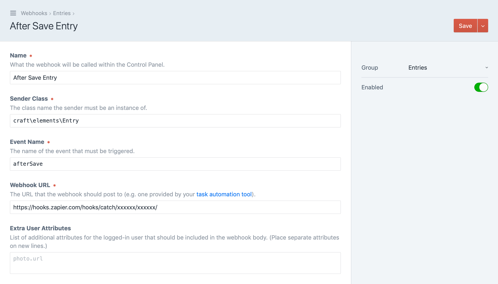
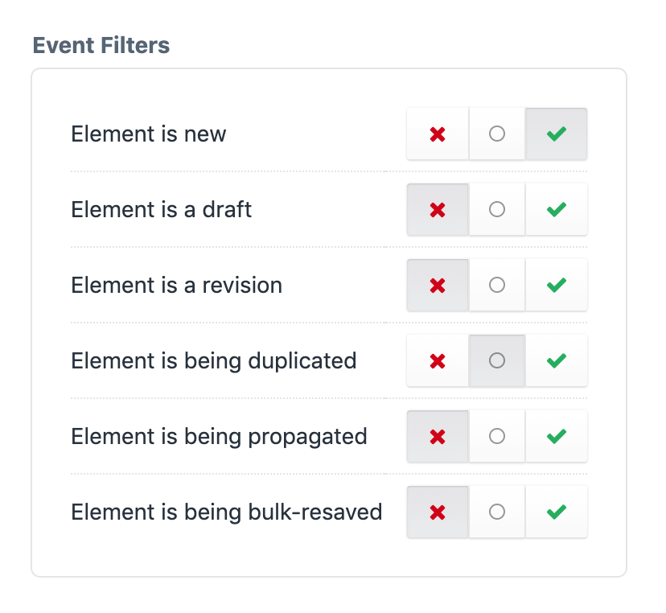
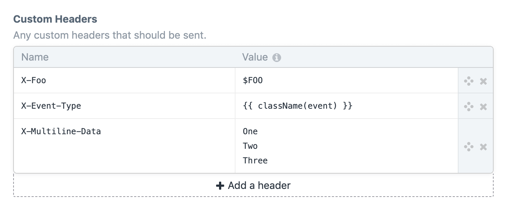

<p align="center"></p>

<h1 align="center">Webhooks for Craft CMS</h1>

This plugin adds the ability to manage “webhooks” in Craft CMS, which will send GET or POST requests when certain events occur.

It can be used to integrate your Craft project with task automation tools like [Zapier](https://zapier.com) or [Netlify](https://www.netlify.com) build hooks.

## Requirements

This plugin requires Craft CMS 4.0 or later.

## Installation

You can install this plugin from the Plugin Store or with Composer.

#### From the Plugin Store

Go to the Plugin Store in your project’s Control Panel and search for “Webhooks”. Then press **Install** in its modal window.

#### With Composer

Open your terminal and run the following commands:

```bash
# go to the project directory
cd /path/to/my-project.test

# tell Composer to load the plugin
composer require craftcms/webhooks

# tell Craft to install the plugin
./craft install/plugin webhooks
```

## Configuration

To configure Webhooks, go to **Settings** → **Webhooks**, or create a `config/webhooks.php` file, which returns an array.

```php
<?php
return [
    'disableAllWebhooks' => false,
    'maxDepth' => 10,
    'maxAttempts' => 3,
    'initialDelay' => null,
    'retryDelay' => 120,
    'purgeDuration' => 604800, // 7 days
];
```

The array can define the following keys:

- `disableAllWebhooks` – Whether all webhooks should be disabled.
- `maxDepth` – The maximum depth that the plugin should go into objects/arrays when converting them to arrays for event payloads. (Default is `5`.)
- `maxAttempts` – The maximum number of attempts each webhook should have before giving up, if the requests are coming back with non 2xx responses. (Default is `1`.)
- `initialDelay` – The delay (in seconds) that initial webhook request attempts should have.
- `retryDelay` – The delay (in seconds) between webhook attempts. (Default is `60`.)
- `purgeDuration` – The time (in seconds) that request history should be saved in the database before being deletable via garbage collection.

## Managing Webhooks

To manage your webhooks, go to Settings → Webhooks in your project’s Control Panel.

### Webhook Groups

Webhooks can optionally be organized into groups. You can create a new group by clicking the “New group” button in the sidebar.

If a group is deleted, any webhooks in it will become ungrouped. (They will **not** be deleted along with the group.)

### Creating Webhooks

To create a new webhook, click the “New webhook” button.

Webhooks listen to [events](https://www.yiiframework.com/doc/guide/2.0/en/concept-events) triggered by system classes. So you must determine the name of the class that will be triggering the event (the “Sender Class”), as well as the event name (either an `EVENT_*` constant name, or its value).

The Sender Class can be a subclass of the class that triggers the event. For example, all elements fire an [afterSave](https://docs.craftcms.com/api/v3/craft-base-element.html#event-after-save) event after they’ve been saved, courtesy of their base class, [craft\base\Element](https://docs.craftcms.com/api/v3/craft-base-element.html). However if you’re only interested in sending a webhook when an _entry_ gets saved, you can set the Sender Class to [craft\elements\Entry](https://docs.craftcms.com/api/v3/craft-elements-entry.html).

Webhook URLs can be set to an environment variable (`$VARIABLE_NAME`) or Twig code. If you set it to Twig code, you can reference the triggered event via an `event` variable. 

See [Integrating with Task Automation Tools](#integrating-with-task-automation-tools) for examples on how to get a Webhook URL from various task automation tools.



Webhooks can either send a GET request, or a POST request with a JSON body containing the following keys:

- `time` – an ISO-8601-formatted timestamp of the exact moment the event was triggered. (Webhooks are sent via the queue so there will be a slight delay between the time the event was triggered and the webhook was sent.)
- `user` – an object representing the logged-in user at the time the event was triggered.
- `name` – the name of the event.
- `senderClass` – the class name of the event sender.
- `sender` – an object representing the event sender.
- `eventClass` – the class name of the event.
- `event` – an object with keys representing any event class properties that aren’t declared by [yii\base\Event](https://www.yiiframework.com/doc/api/2.0/yii-base-event). (For example, if a [craft\events\ElementEvent](https://docs.craftcms.com/api/v3/craft-events-elementevent.html) is triggered, this will contain [element](https://docs.craftcms.com/api/v3/craft-events-elementevent.html#property-element) and [isNew](https://docs.craftcms.com/api/v3/craft-events-elementevent.html#property-isnew) keys.)

#### Filtering Events

Some events can have filters applied to them, which prevent webhooks from being executed under certain conditions.



Ignored filters (`○`) will not have any impact. Positive filters (`✓`) will be required for a webhook to execute, and a negative filter (`×`) will prevent it.

Only element class events and certain `craft\services\Elements` events have any filters out of the box, but modules and plugins can register additional filters using the `craft\webhooks\Plugin::EVENT_REGISTER_FILTER_TYPES` event.

```php
use yii\base\Event;
use craft\webhooks\Plugin as Webhooks;
use craft\events\RegisterComponentTypesEvent;

Event::on(
    Webhooks::class, 
    Webhooks::EVENT_REGISTER_FILTER_TYPES, 
    function(RegisterComponentTypesEvent $event) {
        $event->types[] = ArticleFilter::class;
    }
);
```

Filter type classes must implement `craft\webhooks\filters\FilterInterface`:

```php
use craft\webhooks\filters\FilterInterface;
use craft\elements\Entry;
use yii\base\Event;

class ArticleFilter implements FilterInterface
{
    public static function displayName(): string
    {
        return 'Entry has an “Article” type';
    }

    public static function show(string $class, string $event): bool
    {
        // Only show this filter if the Sender Class is set to 'craft\elements\Entry' 
        return $class === Entry::class;
    }

    public static function check(Event $event, bool $value): bool
    {
        // Filter based on whether the entry's type is 'article':
        /** @var Entry $entry */
        $entry = $event->sender;
        return ($entry->type->handle === 'article') === $value;
    }
}
```

#### Debouncing Webhooks

You can prevent multiple similar webhooks from being sent by setting a “Debounce Key Format” on your webhook. This is a Twig template that defines a “debounce key” for the webhook. If two webhooks generate the same debounce key, only the second one will actually be sent.  

An `event` variable will be available to it that references the event that was triggered.

For example, if your webhook is for an entry (`craft\elements\Entry`), then you could set the Debounce Key Format to `{{ event.sender.id }}` to prevent multiple webhook requests from being queued up at the same time.

#### Sending Custom Headers

You can send custom headers along with webhook requests using the Custom Headers setting.



Header values can be set to an environment variable using the `$VARIABLE_NAME` syntax, or a Twig template.

An `event` variable will be available to the Twig template, set to the event that triggered the webhook.

You can have multiple headers that have the same name, and if a header value takes up multiple lines (after any empty lines have been discarded), each line will be sent as its own header, all using the same header name.

#### Sending More Data

If you need more data than what’s in the default POST request payload, you can fill in the “Extra User Attributes”, “Extra Sender Attributes”, and “Extra Event Attributes” fields.

The attributes listed here (separated by newlines) will be passed to the `$extraFields` argument of the user/sender/event-property’s [toArray()](https://www.yiiframework.com/doc/api/2.0/yii-base-arrayabletrait#toArray()-detail) method (if it has one).

For “Extra Event Attributes”, each attribute should be prefixed with the name of the property and a dot (e.g. `element.author` will include the `author` attribute of an `$element` property).

#### Sending Custom Payloads

You can completely customize the webhook payload by ticking the “Send a custom payload” checkbox. That will reveal the “Payload Template” field, where you can enter the desired body contents.

That field supports Twig, so you can make this dynamic. An `event` variable will be available to it that references the event that was triggered.

```twig

{{
  {
    time: now|atom,
    user: currentUser.username ?? null,
    name: event.name,
    entry: {
      class: className(entry),
      id: entry.id,
      title: entry.title,
      slug: entry.slug,
      isNew: event.isNew
    }
  }|json_encode|raw
}}
```

If the output is valid JSON, then webhook requests will be sent with an `application/json` content type.

### Toggling Webhooks

Webhooks can be enabled or disabled from both the Webhooks index page and within their Edit Webhook pages.

Only enabled webhooks will send webhook requests when their corresponding events are triggered.

You can disable *all* webhooks by setting `disableAllWebhooks` to `true` in your `config/webhooks.php` file.

```php
return [
    'disableAllWebhooks' => true,
    // ...
];
```

## Integrating with Task Automation Tools

### Netlify

To trigger a [Netlify](https://www.netlify.com) build using Webhooks, follow these steps:

1. Within your Netlify dashboard, go to **Settings** → **Build & deploy** → **Continuous deployment** → **Build hooks**.
2. Select **Add build hook**.
3. Fill out the build hook settings and save it.
4. Copy the build hook URL.
5. Within your Craft control panel, go to **Webhooks** → **New webhook**.
6. Paste the build hook URL into the **Webhook URL** field, fill out the remaining settings, and save the webhook.

### Zapier

To integrate Webhooks with [Zapier](https://zapier.com), follow these steps:

1. Within your [Zapier dashboard](https://zapier.com/app/dashboard), click **Make a Zap!**.
2. Select **Webhooks** under **Built-in Apps**.
3. Select **Catch Hook** and click **Save + Continue**.
4. Click **Continue** without entering anything in the **Pick off a Child Key** field.
5. Copy the webhook URL.
6. Within your Craft control panel, go to to **Webhooks** → **New webhook**. 
7. Paste the webhook URL into the **Webhook URL** field, fill out the remaining settings, and save the webhook.
8. Perform an action in Craft that will trigger your webhook.
9. Back in Zapier, click the **Ok, I did this** button.
10. Ensure that Zapier pulled in the webhook, and click **Continue**.
11. Finish setting up the zap and make sure it’s enabled.

### IFTTT

To integrate Webhooks with [IFTTT](https://ifttt.com), follow these steps:

1. Within your [My Applets](https://ifttt.com/my_applets) page in IFTTT, click **New Applet**.
2. Click on **+this**.
3. Search for “webhooks” and select **Webhooks** below.
4. Click **Connect**.
5. Click on the **Receive a web request** box.
6. Give your trigger an event name based on your Craft webhook name, but in `snake_case`.
7. Finish setting up the applet.
8. Go to your [Webhooks page](https://ifttt.com/maker_webhooks) on IFTTT, and click the **Documentation** link.
9. Type the event name you entered in step 6 into the `{event}` text box.
10. Copy the URL beginning with `https://maker.ifttt.com/trigger/`.
6. Within your Craft control panel, go to to **Webhooks** → **New webhook**. 
12. Paste the webhook URL into the **Webhook URL** field, fill out the remaining settings, and save the webhook.

**Note:** Unfortunately IFTTT’s webhooks API is pretty limited, so no webhook data will be available to your applet action.
